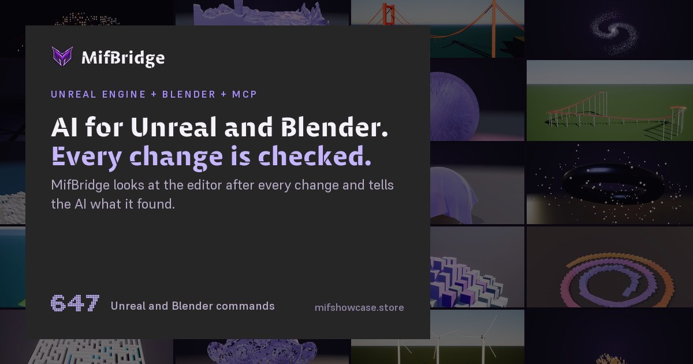
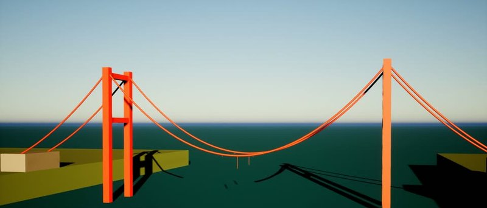
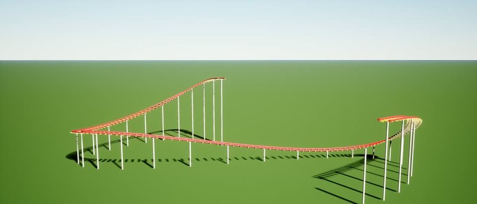
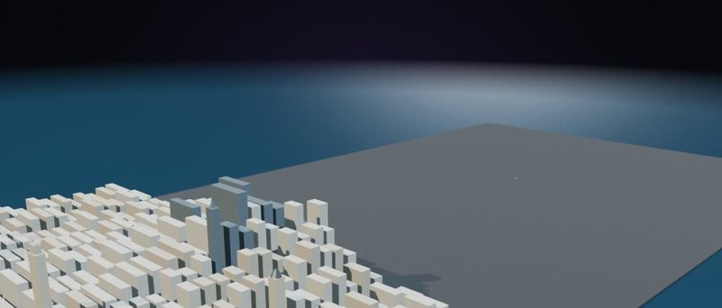
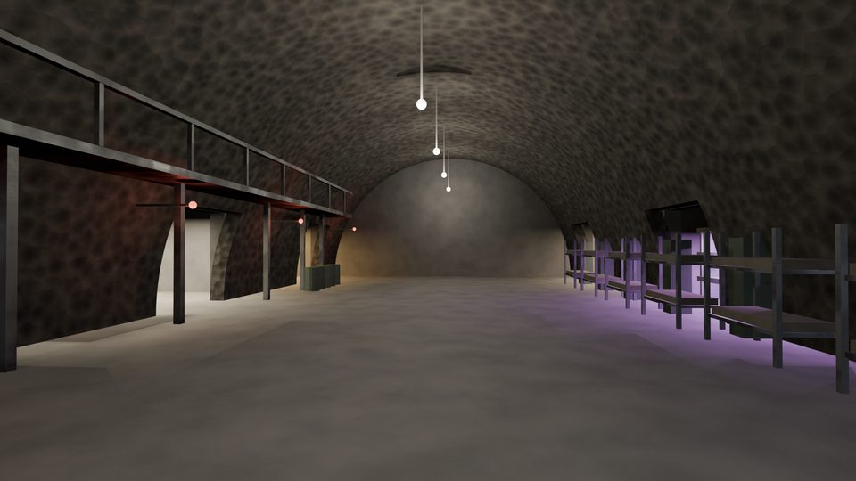
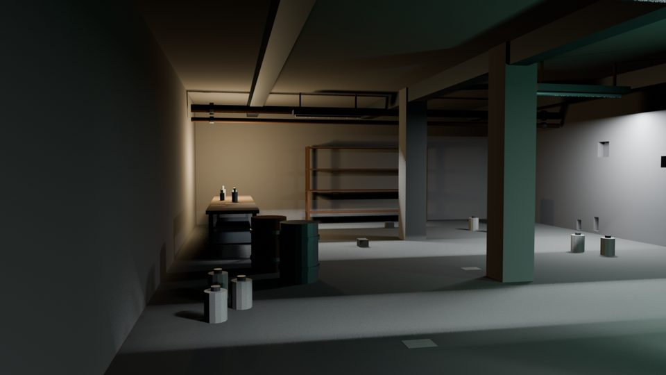
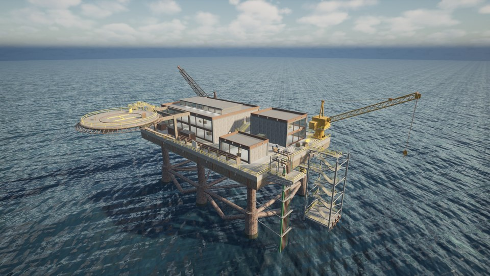

# MifBridge

**Let AI work in Unreal Engine and Blender. Every change is checked.**

[Website](https://mifshowcase.store) · [Docs](https://mifshowcase.store/docs) · [All commands](https://mifshowcase.store/api-reference) · [Supported versions](https://mifshowcase.store/engines) · [Showcase](https://mifshowcase.store/showcase) · [Changelog](https://mifshowcase.store/changelog) · [Discord](https://discord.gg/Q493hqFQDQ)

---

MifBridge lets Claude and other AI assistants work inside Unreal Engine and Blender. It is an MCP server
(MCP is the Model Context Protocol, the standard way AI apps call tools) with two parts:

- **MifBridge**, a plugin for the Unreal Editor. The AI can build and wire Blueprints, work with assets,
  levels, materials and sequences, and gets the editor's own answer back. When a Blueprint fails to
  compile, the AI is told which node and pin caused it.
- **MifBlender**, a free Blender add-on under the MIT license. The AI can model, unwrap UVs, rig, light,
  animate, build Geometry Nodes and render. Each operation checks what it is given and refuses a bad
  value with the values that would work.

After every change, MifBridge looks at the editor to confirm the change really happened and tells the AI
exactly what it found. If a change did not happen, the AI is told that too.

You stay in charge of what the AI may do. MifBridge has three levels: read (look only), scratch (it can
make changes but cannot save them or run risky commands) and full. Only a person can change the level,
in the editor.

## See it work

Each of these was built through MifBridge or MifBlender, one command at a time. Click one to watch it.

<table>
<tr>
<td width="50%" align="center"> <b>Unreal Engine</b> · A city lights up at dusk</td>
<td width="50%" align="center"> <b>Blender</b> · Liquid poured over a head, baked</td>
</tr>
<tr>
<td width="50%" align="center"> <b>Unreal Engine</b> · A suspension bridge, strung cable by cable</td>
<td width="50%" align="center"> <b>Blender</b> · Thirty thousand hairs from one particle call</td>
</tr>
<tr>
<td width="50%" align="center"> <b>Unreal Engine</b> · A roller coaster, laid and then ridden</td>
<td width="50%" align="center"> <b>Blender</b> · Manhattan as a scale model, built in the order its calls ran</td>
</tr>
<tr>
<td width="50%" align="center"> <b>Unreal Engine</b> · A chess set, built and then played</td>
<td width="50%" align="center"> <b>Blender</b> · Cloth over a sphere, baked</td>
</tr>
</table>

<a href="https://mifshowcase.store/showcase"><b>See every showcase video</b></a>

## In the editor

<table>
<tr>
<td width="50%" align="center"> Unreal Engine, built with MifBridge</td>
<td width="50%" align="center"> Blender, built with MifBlender</td>
</tr>
<tr>
<td colspan="2" align="center"> A whole game level, built through MifBridge: the <a href="https://mifshowcase.store/oilrig">Small Oil Rig FPS Map</a></td>
</tr>
</table>

## Get it

- **MifBridge:** on [Fab](https://www.fab.com/listings/cfca3a10-c4b4-4737-a029-3bac2703f50a) or on
  [mifshowcase.store](https://mifshowcase.store/store).
- **MifBlender:** a free download from [mifshowcase.store/mifblender](https://mifshowcase.store/mifblender).

The website lists the supported Unreal Engine and Blender versions and how many commands each part has,
with the test results behind every number.

## About this repository

The MifBridge source code is private. This repository is its public home: it holds the links above and a
place to report bugs.

## Reporting a bug

[Open a Bridge report](../../issues/new?template=bridge-report.yml). The form asks for one JSON block: the
command you called, what you sent, what you expected and what actually happened.

Reports with the `bridge-report` label may be picked up and worked on automatically. Only the JSON block
is ever replayed; your notes are read by a person and never run. Any asset paths in it are moved into a
scratch folder first, so your own assets are never opened. If a bug only happens with one particular
asset, say so in the notes, because that one needs a person to look at it.

No GitHub account? Use the form at [mifshowcase.store/report](https://mifshowcase.store/report), or ask in
[Discord](https://discord.gg/Q493hqFQDQ).

## License

MifBridge is proprietary software; see [LICENSE](LICENSE) and the plain-English summary at
[mifshowcase.store/legal](https://mifshowcase.store/legal). MifBlender is under the MIT license. This
repository holds documentation only and does not grant any right to the software itself.
